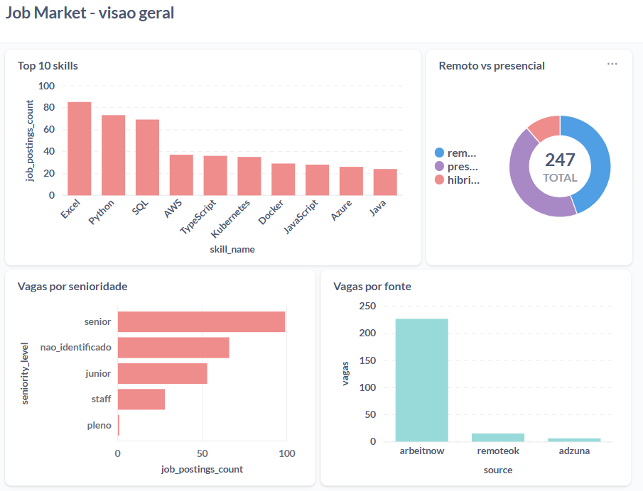

# Job Market Data Pipeline

[](https://github.com/Jx-dev-c/job-market-pipeline/actions/workflows/ci.yml)

Pipeline de dados ponta a ponta sobre o mercado de vagas de tecnologia. Projeto de
portfólio pra Engenharia de Dados.

**Status:** em construção. Produção roda na AWS (S3 + Athena + Glue), dentro do free
tier, em `us-east-2`. Extração, carga, transformação, orquestração diária (Airflow) e
dashboard (Metabase) já rodam ponta a ponta. Dá pra rodar tudo local em Postgres
também (`--target dev`), sem custo.

Setup da AWS: [`docs/setup_aws.md`](docs/setup_aws.md).
A versão GCP (BigQuery/GCS) ainda funciona como `--target prod_gcp`, ver
[`docs/migrar_para_gcp.md`](docs/migrar_para_gcp.md).

## Por que este projeto

Queria acompanhar tendências do mercado de vagas (skills mais pedidas, senioridade,
remoto vs presencial) enquanto procurava vaga, e ao mesmo tempo ter uma peça de
portfólio com o ciclo completo: ingestão, orquestração, transformação, modelagem e
visualização.

As fontes são só APIs públicas/oficiais (Adzuna, Arbeitnow, RemoteOK). Nada de scraping
ou login automatizado em LinkedIn/Glassdoor: isso viola os termos de uso dessas
plataformas.

## Arquitetura

```
APIs (Adzuna, Arbeitnow, RemoteOK)
  -> extract/ (Python, retry/backoff, validação com pydantic)
  -> S3 raw/bronze (particionado por ingestion_date)
  -> Glue Data Catalog (tabelas externas, partition projection)
  -> Airflow (orquestração diária)
  -> dbt (staging -> intermediate -> marts)
  -> Athena
  -> Metabase (lê os marts; local aponta pro Postgres, ver docs/setup_aws.md)
```

Detalhes e decisões em [`docs/architecture.md`](docs/architecture.md).

## Dashboard



Skills mais pedidas, remoto vs presencial, senioridade e volume por fonte. Roda no
Metabase sobre os marts do dbt.

## Como rodar

Setup, variáveis de ambiente e comandos em [`docs/desenvolvimento.md`](docs/desenvolvimento.md).

## Limitações conhecidas

- As fontes têm viés geográfico (Arbeitnow puxa pra Europa, RemoteOK pra remoto
  EUA/Europa). A cobertura pro Brasil ainda precisa ser validada melhor.
- A maior parte do que entra não é vaga de tecnologia. Numa amostra de 969 vagas, só
  246 (25%) casaram com alguma skill do `skills_keywords.csv`; o resto é açougueiro,
  atendente de farmácia, auxiliar de produção. As fontes são boards generalistas e os
  marts ainda não filtram por escopo, então os gráficos misturam os dois mundos.
- Skill e senioridade saem de regex + um CSV de keywords, não de NLP. Na mesma amostra,
  49% das vagas ficam sem senioridade identificável, ou 27% se olhar só as de
  tecnologia. A senioridade tenta o título primeiro e cai pra descrição quando o título
  não resolve; a descrição acerta 87% das vezes em que dispara, então `seniority_source`
  marca de onde veio o rótulo pra dar pra filtrar só o sinal de título.
